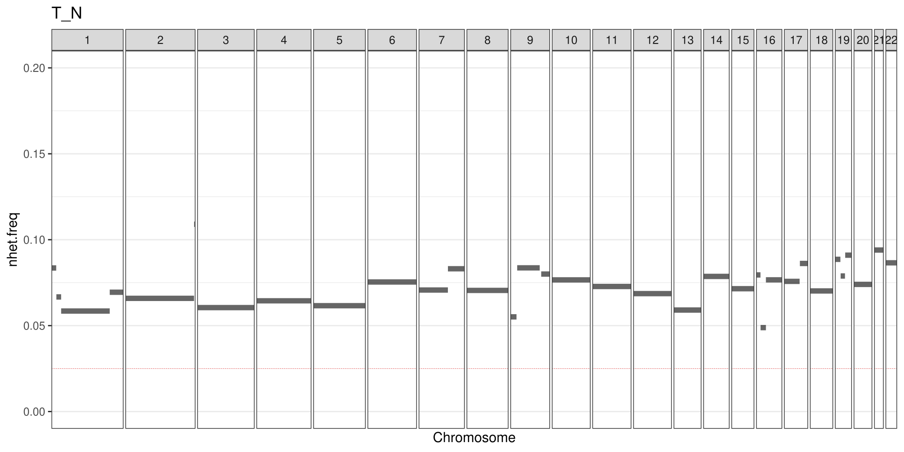
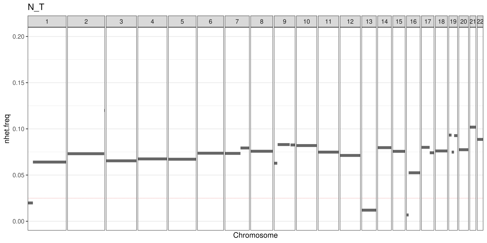
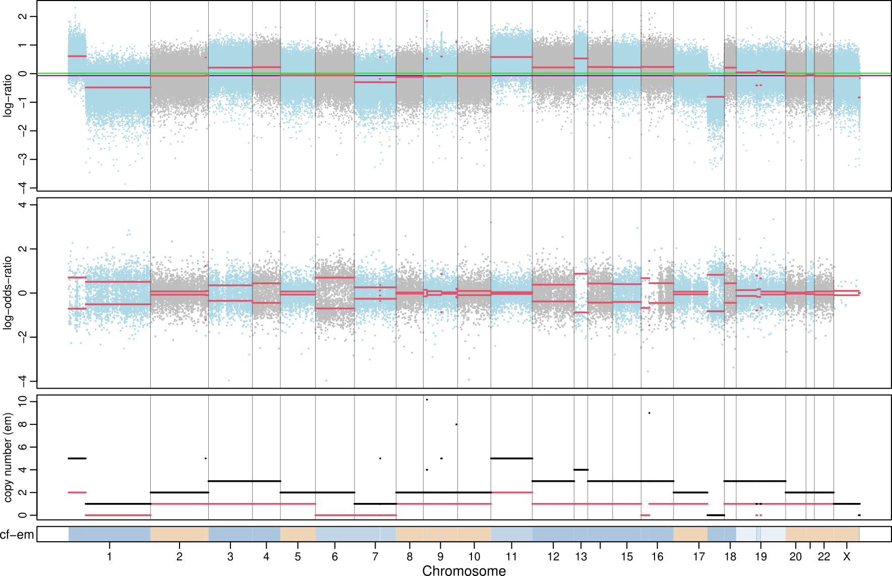
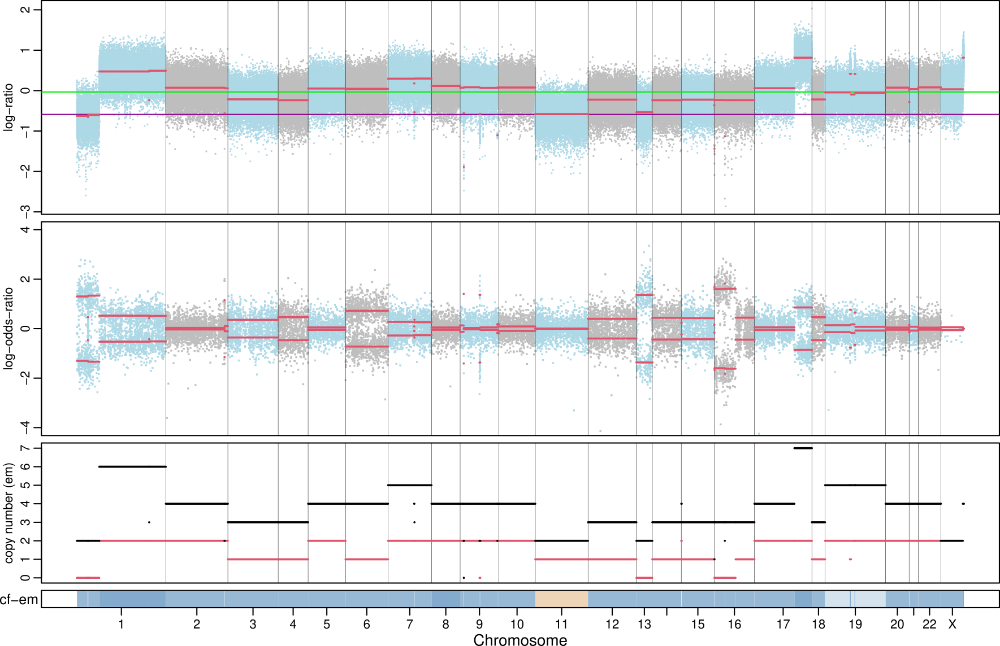

# Identify tumor/normal swaps from facets results

Tumor/normal sample swaps are not easy to spot. One possibility is to look into [facets](https://github.com/mskcc/facets) plots, notably the log-odds-ratio, and see if some segments have a fewer-than-usual number of markers (dots), similar to what we see in the X chromosome in samples from males. To facilitate this process, this script will plot the ratio of heterozygous vs. total number of markers (germline SNPs) that *facets* used for the analysis of each CN segment (`HetMarkFreq.pdf`), as well as the cumulative size (MB) of the genome that contains a ratio of heterozygous markers below a certain threshold (default 0.025). In case of a correct tumor/normal assignment, the result (`HetMarkFreq.txt`) should be `0 MB`, and above zero in case of a swap.

**Note**:
1. This strategy assumes that all tumors have regions with LOH or amplifications, so when a tumor is assigned as the normal, facet will fail to identify heterozygous germline SNPs in these regions (facets expects a normal heterozygous SNP allele frequency to be around 0.5).
2. This strategy will likely fail for samples with very low tumor content, and/or tumors with a flat CN profile!

<br>

## Usage
`facetsHetMarkFreq.R [options] [facets cncf file]`

```
Options:
	--minMarks=MINMARKS
		minimum number of markers that must be present in a segment [1000]

	--threshold=THRESHOLD
		nhet frequency threshold [0.025]

	--outPrefix=OUTPREFIX
		prefix for output files [will deduce from input]

	-h, --help
		Show this help message and exit
```

## Example

#### No swap



#### Tumor/Normal swap


`cumulative segment size with nhet frequency below threshold: 144.6 MB`

<br>

To better understand what is going on, let's look at CN results from *facets* below.

For the swapped samples, there is an obvious decrease of abundance of informative (heterozygous) SNPs in regions of chr1, chr13 and chr15 (density of dots in the middle `log-odds-ratio` plot).


When the samples are not swapped, we can see that these regions correspond to LOH (`copy number (em)` = 0, in the bottom plot).

